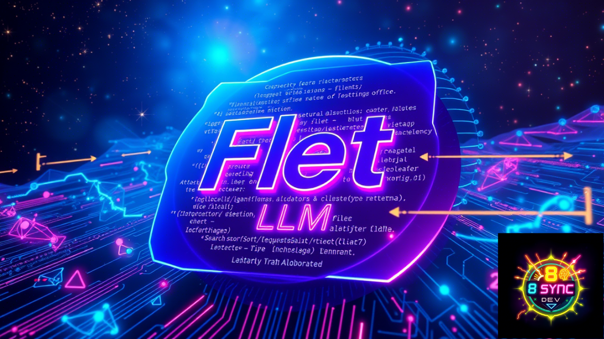

# AI Agent Chat sử dụng Ollama, LangChain, FletUI Python



[Video hướng dẫn chi tiết](https://youtu.be/vW4WP8lEE7g)

[Website](https://syncdev8.com)

Ứng dụng giao diện trò chuyện hiện đại kết nối với mô hình Ollama LLM, được xây dựng bằng framework Flet.

## Tính năng

- Giao diện người dùng đẹp, đáp ứng với các thành phần hoạt ảnh
- Tích hợp với mô hình Ollama LLM (hiện đang sử dụng qwen2.5-coder:1.5b)
- Hiển thị lịch sử tin nhắn với AI và người dùng
- Hoạt ảnh loading khi đợi phản hồi từ AI
- Bảng điều hướng có thể thu gọn

## Cài đặt

### Yêu cầu

- Python 3.8+
- Ollama đã được cài đặt và chạy trên máy

### Thiết lập

1. Clone repository:
```bash
git clone https://github.com/yourusername/ai-agent-chat.git
cd ai-agent-chat
```

2. Tạo môi trường ảo và kích hoạt:
```bash
python -m venv venv
source venv/bin/activate  # Trên Windows: venv\Scripts\activate
```

3. Cài đặt các phụ thuộc:
```bash
pip install -r requirements.txt
```

## Chạy ứng dụng

```bash
python main.py
```

## Cấu trúc dự án

- `main.py` - Điểm vào của ứng dụng
- `app/` - Gói ứng dụng chính
  - `animations/` - Tiện ích hoạt ảnh
  - `components/` - Các thành phần UI (Header, MessageCard, Loading)
  - `model_llm/` - Tích hợp LLM với Ollama
  - `providers/` - Quản lý trạng thái màn hình
  - `screens/` - Các màn hình ứng dụng (Home, Navigation)

## Cách sử dụng

1. Nhập câu hỏi của bạn vào ô văn bản ở dưới cùng màn hình
2. Nhấp vào nút gửi hoặc nhấn Enter
3. Đợi phản hồi từ AI
4. Sử dụng nút menu trong tiêu đề để thu gọn/mở rộng bảng điều hướng

## Công nghệ

- [Flet](https://flet.dev/) - Framework UI sử dụng Flutter cho Python
- [LangChain](https://www.langchain.com/) - Framework phát triển ứng dụng LLM
- [Ollama](https://ollama.ai/) - Chạy các mô hình LLM cục bộ

## Liên hệ

- 🌐 Website: [syncdev8.com](https://syncdev8.com)
- 📱 Facebook: [8sync](https://www.facebook.com/8sync)
- 🎵 Tiktok: [@_8_sync_](https://www.tiktok.com/@_8_sync_)
- 💬 Nhóm Zalo: [Tham gia](https://zalo.me/g/mitxdi486)
- 💻 Github: [8syncdev](https://github.com/8syncdev)
